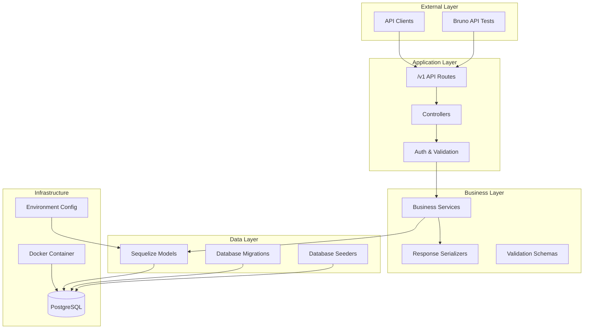
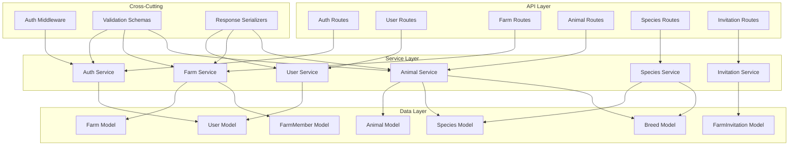
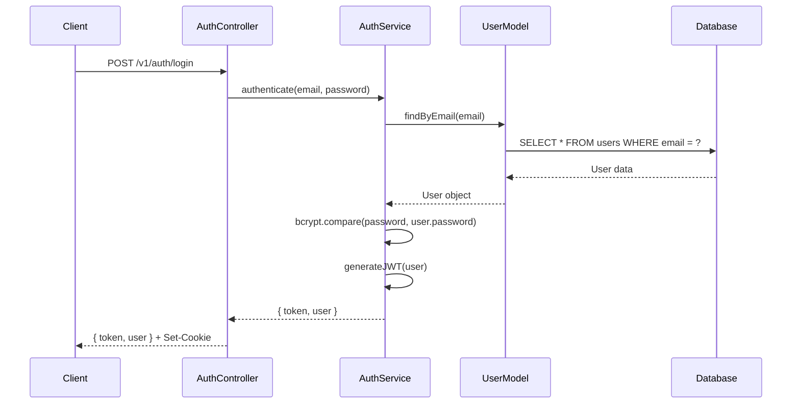
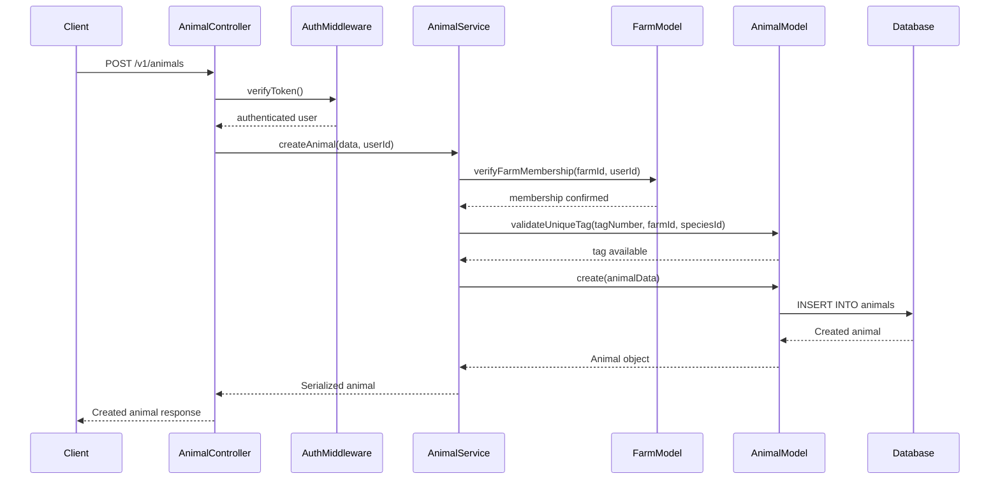
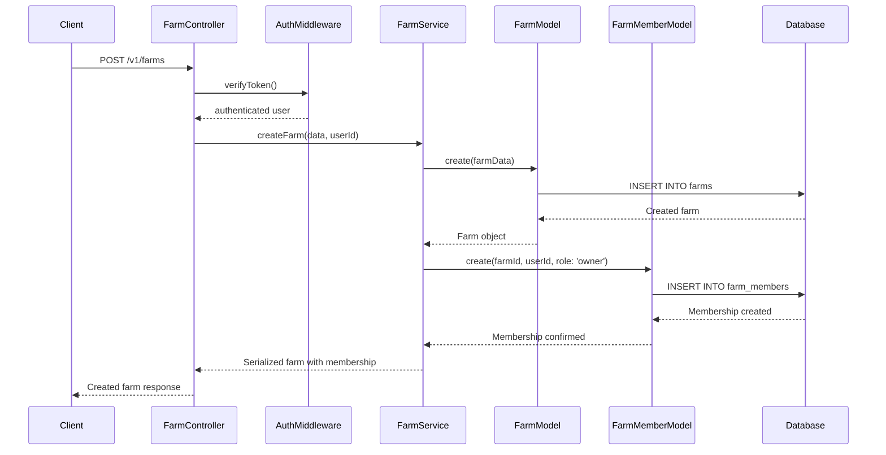

# Ovejitas-api Architecture Document

## Introduction

This document outlines the overall project architecture for Ovejitas-api, including backend systems, shared services, and non-UI specific concerns. Its primary goal is to serve as the guiding architectural blueprint for AI-driven development, ensuring consistency and adherence to chosen patterns and technologies.

**Relationship to Frontend Architecture:**
If the project includes a significant user interface, a separate Frontend Architecture Document will detail the frontend-specific design and MUST be used in conjunction with this document. Core technology stack choices documented herein (see "Tech Stack") are definitive for the entire project, including any frontend components.

### Starter Template or Existing Project

**Status:** Existing Project - The Ovejitas-api is a brownfield Node.js/TypeScript REST API with established patterns and architecture. This document describes the current implementation and serves as a guide for future development.

**Existing Architecture Analysis:**
- **Technology Stack:** Node.js 18 with TypeScript 5.8.3, Fastify 5.3.2 framework
- **Database:** PostgreSQL 14 with Sequelize ORM 6.37.7
- **Authentication:** JWT-based authentication with bcryptjs password hashing
- **API Design:** RESTful endpoints with versioning (/v1)
- **Development:** Docker-based development environment with hot reloading
- **Testing:** Bruno API collection for endpoint testing

### Change Log

| Date | Version | Description | Author |
|------|---------|-------------|---------|
| 2025-01-11 | 1.0 | Initial architecture documentation | Winston (AI Architect) |

## High Level Architecture

### Technical Summary

The Ovejitas-api follows a **layered monolithic architecture** with clear separation of concerns across controllers, services, models, and data access layers. Built on Node.js with TypeScript for type safety, it uses Fastify for high-performance request handling and Sequelize for robust database operations with PostgreSQL. The system implements **multi-tenant architecture** with farm-based data isolation, JWT-based authentication, and comprehensive input validation. This architecture supports the core goal of livestock management across multiple farms while maintaining data integrity and security.

### High Level Overview

**Architectural Style:** Layered Monolithic Architecture with Multi-Tenant Support
- **Repository Structure:** Single repository (monorepo potential with shared packages)
- **Service Architecture:** Single service with clear internal boundaries
- **Data Flow:** HTTP Request → Authentication → Validation → Business Logic → Data Access → Response
- **Multi-Tenancy:** Farm-based data isolation with referential integrity
- **Key Decisions:**
  - **Monolithic over Microservices:** Simpler deployment and development for livestock management domain
  - **PostgreSQL over NoSQL:** Strong consistency requirements for financial/regulatory data
  - **Fastify over Express:** Performance benefits for high-throughput API operations
  - **Sequelize ORM:** Robust migration system and relationship management for complex data models

### High Level Project Diagram



### Architectural and Design Patterns

- **Layered Architecture:** Clean separation between presentation, business logic, and data access layers - _Rationale:_ Enables maintainability and testability while supporting team development practices
- **Multi-Tenant Architecture:** Farm-based data isolation with referential integrity - _Rationale:_ Supports business model of managing multiple farms while ensuring data security and compliance
- **Repository Pattern:** Abstract data access through Sequelize models - _Rationale:_ Enables testing, migration flexibility, and maintains clean business logic
- **MVC Pattern:** Controllers handle HTTP concerns, Services contain business logic - _Rationale:_ Clear separation of concerns following established Node.js patterns
- **Serializer Pattern:** Transform internal models to API responses - _Rationale:_ Consistent API responses and protection of internal data structures
- **Validation at Boundaries:** Input validation using dedicated schemas - _Rationale:_ Security and data integrity with clear error handling

## Tech Stack

### Cloud Infrastructure

- **Provider:** Docker-based (Development), Cloud provider TBD for production
- **Key Services:** PostgreSQL database, containerized application runtime
- **Deployment Regions:** To be determined based on primary user base

### Technology Stack Table

| Category | Technology | Version | Purpose | Rationale |
|----------|------------|---------|---------|-----------|
| **Language** | TypeScript | 5.8.3 | Primary development language | Strong typing, excellent tooling, prevents runtime errors |
| **Runtime** | Node.js | 18 (Alpine) | JavaScript runtime | LTS version, mature ecosystem, excellent performance |
| **Framework** | Fastify | 5.3.2 | Backend web framework | High performance, built-in validation, plugin ecosystem |
| **Database** | PostgreSQL | 14 | Primary database | ACID compliance, strong consistency, mature ecosystem |
| **ORM** | Sequelize | 6.37.7 | Database ORM | Mature ORM, excellent TypeScript support, robust migrations |
| **Authentication** | JWT | 9.0.2 | Token-based auth | Stateless auth, scalable, industry standard |
| **Password Hashing** | bcryptjs | 3.0.2 | Password security | Secure password hashing, salt generation |
| **Validation** | Fastify Schemas | Built-in | Input validation | Integrated with framework, JSON Schema based |
| **Development** | nodemon | 3.1.10 | Development server | Hot reloading, productivity enhancement |
| **Build** | TypeScript Compiler | 5.8.3 | Code compilation | Built-in TypeScript build process |
| **Testing** | Bruno | - | API testing | Visual API testing, collection management |
| **Container** | Docker | - | Development environment | Consistent development environment |
| **Environment** | dotenv | Latest | Configuration management | Environment-based configuration |

## Data Models

### User
**Purpose:** System users who can be members of multiple farms with different roles

**Key Attributes:**
- id: UUID - Primary identifier
- email: string - Unique email address for authentication
- username: string - Unique username for login
- password: string - Hashed password using bcryptjs
- firstName: string - User's first name
- lastName: string - User's last name
- createdAt: timestamp - Account creation date
- updatedAt: timestamp - Last modification date

**Relationships:**
- Has many FarmMembers (user can belong to multiple farms)
- Has many FarmInvitations (pending invitations)

### Farm
**Purpose:** Multi-tenant container for livestock management operations

**Key Attributes:**
- id: UUID - Primary identifier
- name: string - Farm name
- description: text - Farm description
- location: string - Farm location
- ownerId: UUID - Reference to User who owns the farm
- createdAt: timestamp - Farm creation date
- updatedAt: timestamp - Last modification date

**Relationships:**
- Belongs to User (owner)
- Has many FarmMembers (farm team members)
- Has many Animals (livestock managed by farm)
- Has many FarmInvitations (pending member invitations)

### Species
**Purpose:** Livestock species classification (cattle, sheep, goats, etc.)

**Key Attributes:**
- id: UUID - Primary identifier
- name: string - Species name
- scientificName: string - Scientific classification
- description: text - Species description
- createdAt: timestamp - Record creation date
- updatedAt: timestamp - Last modification date

**Relationships:**
- Has many Breeds (species can have multiple breeds)
- Has many Animals (through breed relationship)
- Has many SpeciesTranslations (internationalization)

### Breed
**Purpose:** Specific breed classification within a species

**Key Attributes:**
- id: UUID - Primary identifier
- name: string - Breed name
- description: text - Breed description
- speciesId: UUID - Reference to Species
- createdAt: timestamp - Record creation date
- updatedAt: timestamp - Last modification date

**Relationships:**
- Belongs to Species
- Has many Animals (animals of this breed)

### Animal
**Purpose:** Individual livestock records with tracking information

**Key Attributes:**
- id: UUID - Primary identifier
- name: string - Animal name
- tagNumber: string - Unique identification tag (per farm/species)
- farmId: UUID - Reference to Farm (tenant isolation)
- speciesId: UUID - Reference to Species
- breedId: UUID - Reference to Breed
- dateOfBirth: date - Animal's birth date
- sex: enum - Male/Female/Other
- weight: decimal - Current weight
- height: decimal - Current height
- bodyCondition: integer - Body condition score
- createdAt: timestamp - Record creation date
- updatedAt: timestamp - Last modification date

**Relationships:**
- Belongs to Farm (multi-tenant isolation)
- Belongs to Species
- Belongs to Breed
- Has many temporal tracking records (future enhancement)

### FarmMember
**Purpose:** Junction table for farm membership with roles

**Key Attributes:**
- farmId: UUID - Reference to Farm
- userId: UUID - Reference to User
- role: enum - Member role (owner, manager, worker)
- joinedAt: timestamp - Membership start date
- createdAt: timestamp - Record creation date
- updatedAt: timestamp - Last modification date

**Relationships:**
- Belongs to Farm
- Belongs to User

### FarmInvitation
**Purpose:** Pending farm membership invitations

**Key Attributes:**
- id: UUID - Primary identifier
- farmId: UUID - Reference to Farm
- email: string - Invited user email
- role: enum - Intended role
- token: string - Invitation token
- status: enum - Pending/Accepted/Declined/Expired
- expiresAt: timestamp - Invitation expiration
- createdAt: timestamp - Invitation creation date
- updatedAt: timestamp - Last modification date

**Relationships:**
- Belongs to Farm

## Components

### Authentication Service
**Responsibility:** Handles user authentication, JWT token generation, password management, and session validation

**Key Interfaces:**
- POST /v1/auth/login - User authentication
- POST /v1/auth/signup - User registration
- POST /v1/auth/logout - Session termination
- GET /v1/auth/me - Current user profile

**Dependencies:** User model, bcryptjs, jsonwebtoken, validation schemas

**Technology Stack:** Fastify routes, JWT middleware, bcryptjs password hashing

### User Management Service
**Responsibility:** Manages user profiles, account settings, and user-related operations

**Key Interfaces:**
- GET /v1/users/profile - Get user profile
- PUT /v1/users/profile - Update user profile
- DELETE /v1/users/account - Delete user account

**Dependencies:** User model, authentication middleware, validation schemas

**Technology Stack:** Fastify controllers, Sequelize User model, response serializers

### Farm Management Service
**Responsibility:** Handles farm operations, membership management, and multi-tenant data isolation

**Key Interfaces:**
- GET /v1/farms - List user's farms
- POST /v1/farms - Create new farm
- GET /v1/farms/:id - Get farm details
- PUT /v1/farms/:id - Update farm
- DELETE /v1/farms/:id - Delete farm
- POST /v1/farms/:id/members - Add farm member
- DELETE /v1/farms/:id/members/:userId - Remove farm member

**Dependencies:** Farm model, FarmMember model, User model, authentication middleware

**Technology Stack:** Fastify controllers, Sequelize models with associations, tenant isolation middleware

### Animal Management Service
**Responsibility:** Manages livestock records, species/breed data, and animal tracking within farm boundaries

**Key Interfaces:**
- GET /v1/animals - List farm animals
- POST /v1/animals - Create animal record
- GET /v1/animals/:id - Get animal details
- PUT /v1/animals/:id - Update animal record
- DELETE /v1/animals/:id - Delete animal record

**Dependencies:** Animal model, Species model, Breed model, Farm model, tenant validation

**Technology Stack:** Fastify controllers, Sequelize models with complex relationships, validation schemas

### Species & Breed Management Service
**Responsibility:** Manages livestock taxonomy, breed information, and species translations

**Key Interfaces:**
- GET /v1/species - List available species
- GET /v1/species/:id/breeds - List breeds for species
- POST /v1/species - Create new species (admin)
- POST /v1/breeds - Create new breed (admin)

**Dependencies:** Species model, Breed model, SpeciesTranslation model

**Technology Stack:** Fastify controllers, Sequelize models, internationalization support

### Invitation Management Service
**Responsibility:** Handles farm member invitations, token generation, and invitation lifecycle

**Key Interfaces:**
- POST /v1/invitations - Send farm invitation
- GET /v1/invitations/verify/:token - Verify invitation token
- POST /v1/invitations/accept/:token - Accept invitation
- POST /v1/invitations/decline/:token - Decline invitation

**Dependencies:** FarmInvitation model, Farm model, User model, email service (future)

**Technology Stack:** Fastify controllers, Sequelize models, token generation utilities

### Component Diagrams



## External APIs

No external APIs are currently integrated. The system is designed to be self-contained for livestock management operations. Future integrations may include:

- **Weather Services:** For environmental data affecting livestock
- **Veterinary Services:** For health record integration
- **Market Data APIs:** For livestock pricing information
- **Government APIs:** For regulatory compliance and reporting

## Core Workflows

### User Authentication Flow



### Animal Creation Flow



### Farm Management Flow



## REST API Spec

```yaml
openapi: 3.0.0
info:
  title: Ovejitas API
  version: 1.0.0
  description: Livestock management system API for multi-tenant farm operations
servers:
  - url: http://localhost:3000
    description: Development server
  - url: https://api.ovejitas.com
    description: Production server

security:
  - bearerAuth: []

paths:
  /v1/auth/login:
    post:
      summary: Authenticate user
      requestBody:
        required: true
        content:
          application/json:
            schema:
              type: object
              properties:
                email:
                  type: string
                  format: email
                password:
                  type: string
                  minLength: 6
      responses:
        '200':
          description: Authentication successful
          content:
            application/json:
              schema:
                type: object
                properties:
                  token:
                    type: string
                  user:
                    $ref: '#/components/schemas/User'
        '401':
          description: Invalid credentials

  /v1/auth/signup:
    post:
      summary: Register new user
      requestBody:
        required: true
        content:
          application/json:
            schema:
              type: object
              properties:
                email:
                  type: string
                  format: email
                username:
                  type: string
                  minLength: 3
                password:
                  type: string
                  minLength: 6
                firstName:
                  type: string
                lastName:
                  type: string
      responses:
        '201':
          description: User created successfully
        '400':
          description: Validation error

  /v1/farms:
    get:
      summary: List user's farms
      security:
        - bearerAuth: []
      responses:
        '200':
          description: List of farms
          content:
            application/json:
              schema:
                type: array
                items:
                  $ref: '#/components/schemas/Farm'
    post:
      summary: Create new farm
      security:
        - bearerAuth: []
      requestBody:
        required: true
        content:
          application/json:
            schema:
              type: object
              properties:
                name:
                  type: string
                description:
                  type: string
                location:
                  type: string
      responses:
        '201':
          description: Farm created successfully

  /v1/animals:
    get:
      summary: List farm animals
      security:
        - bearerAuth: []
      parameters:
        - name: farmId
          in: query
          required: true
          schema:
            type: string
            format: uuid
      responses:
        '200':
          description: List of animals
          content:
            application/json:
              schema:
                type: array
                items:
                  $ref: '#/components/schemas/Animal'
    post:
      summary: Create new animal
      security:
        - bearerAuth: []
      requestBody:
        required: true
        content:
          application/json:
            schema:
              type: object
              properties:
                name:
                  type: string
                tagNumber:
                  type: string
                farmId:
                  type: string
                  format: uuid
                speciesId:
                  type: string
                  format: uuid
                breedId:
                  type: string
                  format: uuid
                dateOfBirth:
                  type: string
                  format: date
                sex:
                  type: string
                  enum: [male, female, other]
      responses:
        '201':
          description: Animal created successfully

components:
  securitySchemes:
    bearerAuth:
      type: http
      scheme: bearer
      bearerFormat: JWT

  schemas:
    User:
      type: object
      properties:
        id:
          type: string
          format: uuid
        email:
          type: string
          format: email
        username:
          type: string
        firstName:
          type: string
        lastName:
          type: string
        createdAt:
          type: string
          format: date-time

    Farm:
      type: object
      properties:
        id:
          type: string
          format: uuid
        name:
          type: string
        description:
          type: string
        location:
          type: string
        ownerId:
          type: string
          format: uuid
        createdAt:
          type: string
          format: date-time

    Animal:
      type: object
      properties:
        id:
          type: string
          format: uuid
        name:
          type: string
        tagNumber:
          type: string
        farmId:
          type: string
          format: uuid
        speciesId:
          type: string
          format: uuid
        breedId:
          type: string
          format: uuid
        dateOfBirth:
          type: string
          format: date
        sex:
          type: string
          enum: [male, female, other]
        weight:
          type: number
        height:
          type: number
        bodyCondition:
          type: integer
        createdAt:
          type: string
          format: date-time
```

## Database Schema

```sql
-- Users table
CREATE TABLE users (
    id UUID PRIMARY KEY DEFAULT gen_random_uuid(),
    email VARCHAR(255) UNIQUE NOT NULL,
    username VARCHAR(255) UNIQUE NOT NULL,
    password VARCHAR(255) NOT NULL,
    first_name VARCHAR(255) NOT NULL,
    last_name VARCHAR(255) NOT NULL,
    created_at TIMESTAMP DEFAULT CURRENT_TIMESTAMP,
    updated_at TIMESTAMP DEFAULT CURRENT_TIMESTAMP
);

-- Farms table
CREATE TABLE farms (
    id UUID PRIMARY KEY DEFAULT gen_random_uuid(),
    name VARCHAR(255) NOT NULL,
    description TEXT,
    location VARCHAR(255),
    owner_id UUID REFERENCES users(id) ON DELETE CASCADE,
    created_at TIMESTAMP DEFAULT CURRENT_TIMESTAMP,
    updated_at TIMESTAMP DEFAULT CURRENT_TIMESTAMP
);

-- Species table
CREATE TABLE species (
    id UUID PRIMARY KEY DEFAULT gen_random_uuid(),
    name VARCHAR(255) NOT NULL,
    scientific_name VARCHAR(255),
    description TEXT,
    created_at TIMESTAMP DEFAULT CURRENT_TIMESTAMP,
    updated_at TIMESTAMP DEFAULT CURRENT_TIMESTAMP
);

-- Breeds table
CREATE TABLE breeds (
    id UUID PRIMARY KEY DEFAULT gen_random_uuid(),
    name VARCHAR(255) NOT NULL,
    description TEXT,
    species_id UUID REFERENCES species(id) ON DELETE CASCADE,
    created_at TIMESTAMP DEFAULT CURRENT_TIMESTAMP,
    updated_at TIMESTAMP DEFAULT CURRENT_TIMESTAMP
);

-- Animals table
CREATE TABLE animals (
    id UUID PRIMARY KEY DEFAULT gen_random_uuid(),
    name VARCHAR(255) NOT NULL,
    tag_number VARCHAR(255) NOT NULL,
    farm_id UUID REFERENCES farms(id) ON DELETE CASCADE,
    species_id UUID REFERENCES species(id) ON DELETE RESTRICT,
    breed_id UUID REFERENCES breeds(id) ON DELETE RESTRICT,
    date_of_birth DATE,
    sex VARCHAR(10) CHECK (sex IN ('male', 'female', 'other')),
    weight DECIMAL(10,2),
    height DECIMAL(10,2),
    body_condition INTEGER CHECK (body_condition >= 1 AND body_condition <= 5),
    created_at TIMESTAMP DEFAULT CURRENT_TIMESTAMP,
    updated_at TIMESTAMP DEFAULT CURRENT_TIMESTAMP,
    UNIQUE(tag_number, farm_id, species_id)
);

-- Farm members table
CREATE TABLE farm_members (
    farm_id UUID REFERENCES farms(id) ON DELETE CASCADE,
    user_id UUID REFERENCES users(id) ON DELETE CASCADE,
    role VARCHAR(50) DEFAULT 'member' CHECK (role IN ('owner', 'manager', 'member')),
    joined_at TIMESTAMP DEFAULT CURRENT_TIMESTAMP,
    created_at TIMESTAMP DEFAULT CURRENT_TIMESTAMP,
    updated_at TIMESTAMP DEFAULT CURRENT_TIMESTAMP,
    PRIMARY KEY (farm_id, user_id)
);

-- Farm invitations table
CREATE TABLE farm_invitations (
    id UUID PRIMARY KEY DEFAULT gen_random_uuid(),
    farm_id UUID REFERENCES farms(id) ON DELETE CASCADE,
    email VARCHAR(255) NOT NULL,
    role VARCHAR(50) DEFAULT 'member' CHECK (role IN ('owner', 'manager', 'member')),
    token VARCHAR(255) UNIQUE NOT NULL,
    status VARCHAR(50) DEFAULT 'pending' CHECK (status IN ('pending', 'accepted', 'declined', 'expired')),
    expires_at TIMESTAMP NOT NULL,
    created_at TIMESTAMP DEFAULT CURRENT_TIMESTAMP,
    updated_at TIMESTAMP DEFAULT CURRENT_TIMESTAMP
);

-- Species translations table (for internationalization)
CREATE TABLE species_translations (
    id UUID PRIMARY KEY DEFAULT gen_random_uuid(),
    species_id UUID REFERENCES species(id) ON DELETE CASCADE,
    language_code VARCHAR(5) NOT NULL,
    name VARCHAR(255) NOT NULL,
    description TEXT,
    created_at TIMESTAMP DEFAULT CURRENT_TIMESTAMP,
    updated_at TIMESTAMP DEFAULT CURRENT_TIMESTAMP,
    UNIQUE(species_id, language_code)
);

-- Indexes for performance
CREATE INDEX idx_users_email ON users(email);
CREATE INDEX idx_users_username ON users(username);
CREATE INDEX idx_farms_owner_id ON farms(owner_id);
CREATE INDEX idx_animals_farm_id ON animals(farm_id);
CREATE INDEX idx_animals_species_id ON animals(species_id);
CREATE INDEX idx_animals_breed_id ON animals(breed_id);
CREATE INDEX idx_animals_tag_number ON animals(tag_number);
CREATE INDEX idx_farm_members_farm_id ON farm_members(farm_id);
CREATE INDEX idx_farm_members_user_id ON farm_members(user_id);
CREATE INDEX idx_farm_invitations_token ON farm_invitations(token);
CREATE INDEX idx_farm_invitations_email ON farm_invitations(email);
CREATE INDEX idx_species_translations_species_id ON species_translations(species_id);
```

## Source Tree

```
ovejitas-api/
├── src/
│   ├── controllers/v1/             # HTTP request handlers
│   │   ├── auth.controller.ts      # Authentication endpoints
│   │   ├── user.controller.ts      # User management endpoints
│   │   ├── farm.controller.ts      # Farm management endpoints
│   │   ├── animal.controller.ts    # Animal management endpoints
│   │   ├── species.controller.ts   # Species/breed endpoints
│   │   └── invitation.controller.ts # Farm invitation endpoints
│   ├── routes/v1/                  # API route definitions
│   │   ├── auth.routes.ts          # Authentication routes
│   │   ├── user.routes.ts          # User routes
│   │   ├── farm.routes.ts          # Farm routes
│   │   ├── animal.routes.ts        # Animal routes
│   │   ├── species.routes.ts       # Species routes
│   │   └── invitation.routes.ts    # Invitation routes
│   ├── models/                     # Sequelize database models
│   │   ├── User.ts                 # User model
│   │   ├── Farm.ts                 # Farm model
│   │   ├── Animal.ts               # Animal model
│   │   ├── Species.ts              # Species model
│   │   ├── Breed.ts                # Breed model
│   │   ├── FarmMember.ts           # Farm membership model
│   │   ├── FarmInvitation.ts       # Farm invitation model
│   │   ├── SpeciesTranslation.ts   # Species translation model
│   │   └── associations.ts         # Model associations
│   ├── schemas/                    # Input validation schemas
│   │   ├── auth.schema.ts          # Authentication validation
│   │   ├── user.schema.ts          # User validation
│   │   ├── farm.schema.ts          # Farm validation
│   │   ├── animal.schema.ts        # Animal validation
│   │   └── common.schema.ts        # Shared validation schemas
│   ├── serializers/                # Response data transformation
│   │   ├── user.serializer.ts      # User response serializer
│   │   ├── farm.serializer.ts      # Farm response serializer
│   │   ├── animal.serializer.ts    # Animal response serializer
│   │   └── common.serializer.ts    # Shared serializers
│   ├── types/                      # TypeScript type definitions
│   │   ├── auth.types.ts           # Authentication types
│   │   ├── user.types.ts           # User types
│   │   ├── farm.types.ts           # Farm types
│   │   ├── animal.types.ts         # Animal types
│   │   └── common.types.ts         # Shared types
│   ├── utils/                      # Utility functions
│   │   ├── jwt.utils.ts            # JWT token utilities
│   │   ├── password.utils.ts       # Password hashing utilities
│   │   ├── validation.utils.ts     # Validation helpers
│   │   └── response.utils.ts       # Response formatting utilities
│   ├── plugins/                    # Fastify plugins
│   │   ├── auth.plugin.ts          # Authentication plugin
│   │   ├── db.plugin.ts            # Database connection plugin
│   │   └── validation.plugin.ts    # Validation plugin
│   ├── migrations/                 # Database schema migrations
│   │   └── [timestamp]-*.js        # Migration files
│   ├── seeders/                    # Database seed data
│   │   └── [timestamp]-*.js        # Seeder files
│   ├── config/                     # Configuration files
│   │   ├── database.js             # Database configuration
│   │   └── environment.ts          # Environment configuration
│   └── app.ts                      # Application entry point
├── little-sheep/                   # Bruno API test collection
│   └── farm/
│       └── farm-animals/
│           └── create-animal.bru   # API test files
├── docs/                           # Documentation
│   └── architecture.md             # This document
├── docker-compose.yml              # Docker development environment
├── dockerfile                      # Docker build configuration
├── package.json                    # Node.js dependencies
├── tsconfig.json                   # TypeScript configuration
├── .env.example                    # Environment variables template
├── .gitignore                      # Git ignore rules
└── README.md                       # Project documentation
```

## Infrastructure and Deployment

### Infrastructure as Code
- **Tool:** Docker Compose (Development), Cloud provider IaC TBD
- **Location:** `docker-compose.yml` and `dockerfile`
- **Approach:** Container-based development with infrastructure as code for production

### Deployment Strategy
- **Strategy:** Container deployment with environment-based configuration
- **CI/CD Platform:** To be determined (GitHub Actions, GitLab CI, or similar)
- **Pipeline Configuration:** `.github/workflows/` or similar

### Environments
- **Development:** Local Docker environment with hot reloading
- **Test:** Isolated testing environment with test database
- **Staging:** Pre-production environment for validation
- **Production:** Production environment with monitoring and logging

### Environment Promotion Flow
```
Development → Testing → Staging → Production
    ↓           ↓         ↓         ↓
 Feature     Integration  UAT    Live
   Dev         Tests    Testing  Users
```

### Rollback Strategy
- **Primary Method:** Container rollback with previous image version
- **Trigger Conditions:** Health check failures, error rate thresholds
- **Recovery Time Objective:** < 5 minutes for critical services

## Error Handling Strategy

### General Approach
- **Error Model:** Structured error responses with consistent format
- **Exception Hierarchy:** HTTP status codes with application-specific error codes
- **Error Propagation:** Centralized error handling with proper logging

### Logging Standards
- **Library:** Fastify built-in logging (Pino)
- **Format:** JSON structured logging
- **Levels:** ERROR, WARN, INFO, DEBUG
- **Required Context:**
  - Correlation ID: Request ID from Fastify
  - Service Context: Component/service name
  - User Context: User ID (when authenticated)

### Error Handling Patterns

#### External API Errors
- **Retry Policy:** Exponential backoff with jitter
- **Circuit Breaker:** Fail fast after consecutive failures
- **Timeout Configuration:** Request timeout with appropriate limits
- **Error Translation:** Map external errors to internal error codes

#### Business Logic Errors
- **Custom Exceptions:** Domain-specific error classes
- **User-Facing Errors:** Clear, actionable error messages
- **Error Codes:** Consistent error code system for client handling

#### Data Consistency
- **Transaction Strategy:** Database transactions for multi-table operations
- **Compensation Logic:** Rollback patterns for failed operations
- **Idempotency:** Idempotent operations where possible

## Coding Standards

### Core Standards
- **Languages & Runtimes:** TypeScript 5.8.3, Node.js 18
- **Style & Linting:** ESLint with TypeScript rules
- **Test Organization:** Co-located test files with `.test.ts` extension

### Critical Rules
- **Environment Variables:** Always access via config objects, never process.env directly
- **Database Queries:** Use Sequelize models, avoid raw SQL queries
- **Authentication:** All protected routes must use authentication middleware
- **Validation:** Input validation at API boundary using Fastify schemas
- **Error Handling:** Use centralized error handler, never expose internal errors
- **Multi-tenancy:** Always verify farm membership before data access
- **Logging:** Use structured logging, never console.log in production
- **Password Security:** Always hash passwords with bcryptjs, never store plain text

## Test Strategy and Standards

### Testing Philosophy
- **Approach:** Test-driven development with comprehensive coverage
- **Coverage Goals:** 80% code coverage minimum
- **Test Pyramid:** Unit tests (70%), Integration tests (25%), E2E tests (5%)

### Test Types and Organization

#### Unit Tests
- **Framework:** Jest with TypeScript support
- **File Convention:** `*.test.ts` co-located with source files
- **Location:** Adjacent to source files
- **Mocking Library:** Jest built-in mocking
- **Coverage Requirement:** 80% minimum

**AI Agent Requirements:**
- Generate tests for all public methods
- Cover edge cases and error conditions
- Follow AAA pattern (Arrange, Act, Assert)
- Mock all external dependencies

#### Integration Tests
- **Scope:** API endpoints with database interactions
- **Location:** `tests/integration/`
- **Test Infrastructure:**
  - **Database:** Test database with transactions
  - **Authentication:** Test JWT tokens
  - **Network:** Local test server

#### End-to-End Tests
- **Framework:** Bruno API collection
- **Scope:** Complete user workflows
- **Environment:** Development environment
- **Test Data:** Isolated test data with cleanup

### Test Data Management
- **Strategy:** Factory pattern with database transactions
- **Fixtures:** JSON fixtures for reference data
- **Factories:** Dynamic test data generation
- **Cleanup:** Transaction rollback after each test

### Continuous Testing
- **CI Integration:** Automated testing on all commits
- **Performance Tests:** API response time monitoring
- **Security Tests:** Dependency vulnerability scanning

## Security

### Input Validation
- **Validation Library:** Fastify JSON Schema validation
- **Validation Location:** API boundary before processing
- **Required Rules:**
  - All external inputs MUST be validated
  - Validation at API boundary before processing
  - Whitelist approach preferred over blacklist

### Authentication & Authorization
- **Auth Method:** JWT tokens with secure secret
- **Session Management:** Stateless JWT approach
- **Required Patterns:**
  - Protected routes use authentication middleware
  - Farm-based authorization for multi-tenant data
  - Role-based access control for farm operations

### Secrets Management
- **Development:** Environment variables via .env files
- **Production:** Cloud provider secrets management
- **Code Requirements:**
  - NEVER hardcode secrets
  - Access via configuration service only
  - No secrets in logs or error messages

### API Security
- **Rate Limiting:** Fastify rate limiting plugin
- **CORS Policy:** Restrictive CORS configuration
- **Security Headers:** Helmet.js for security headers
- **HTTPS Enforcement:** TLS termination at load balancer

### Data Protection
- **Encryption at Rest:** Database encryption
- **Encryption in Transit:** TLS/HTTPS only
- **PII Handling:** Secure handling of personal information
- **Logging Restrictions:** No passwords or sensitive data in logs

### Dependency Security
- **Scanning Tool:** npm audit and security scanners
- **Update Policy:** Regular dependency updates
- **Approval Process:** Review all new dependencies

### Security Testing
- **SAST Tool:** Static analysis security testing
- **DAST Tool:** Dynamic application security testing
- **Penetration Testing:** Periodic security assessments

## Next Steps

1. **Implementation Priority:**
   - Review and validate this architecture document
   - Set up development environment according to source tree
   - Begin implementing core authentication and user management
   - Implement farm management with multi-tenant isolation
   - Add animal management with proper validation

2. **Architecture Refinements:**
   - Finalize cloud provider selection for production
   - Implement monitoring and logging infrastructure
   - Set up CI/CD pipeline for automated testing and deployment
   - Add comprehensive test coverage

3. **Future Enhancements:**
   - Implement temporal data tracking for animal metrics
   - Add real-time notifications for farm operations
   - Integrate with external APIs for weather and market data
   - Implement advanced reporting and analytics

This architecture provides a solid foundation for scalable livestock management system development while maintaining simplicity and adherence to established patterns.